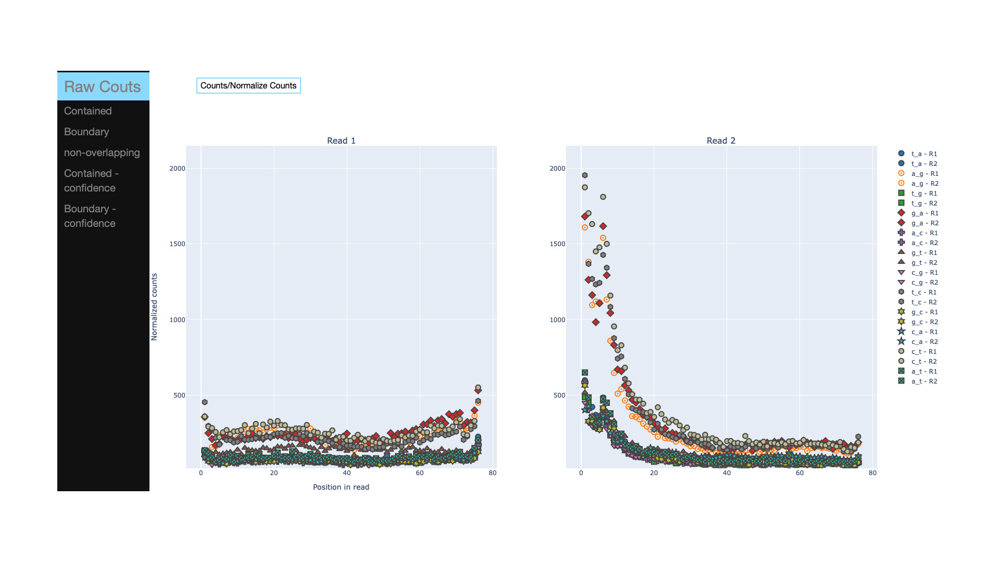

<!---->

Tasmanian
====

A tool for the analysis of reference mismatches in high throughput sequencing data from DNA samples. Unlike other tools, it is able to evalutate the portions of reads that overlap with specified regions (e.g. Repeats)

<!---toc start-->
  * [Goals](#goals)
  * [Contributing](#contributing)
  * [Authors](#authors)
  * [License](#license)

<!---toc end-->

# Goals

The main goal is to identify systematic missmatches that might confound SNPs or other variations that should or should not be associated to biological outcomes. Since we noticed a set of regions, which might not necessarily be missplaced in the reference genome, have dramatic effects in this analysis, we provide a way of spliting these reads and incorporate the information in different tables, so that intersecting/non intersecting reads are not filtered out. Also, the researcher has a more accurate picture of the influence of these regions in the observed artifacts.

* Easy to use command-line and [nextflow](https://www.nextflow.io/) implementation.
* Includes a [Galaxy](https://usegalaxy.org/) wrapper 

<!---->

## Contributing

Contributions are welcome and encouraged.

## Authors

* [Brad Langhorst](https://github.com/bwlang)
* [Ariel Erijman](https://github.com/aerijman)

## License

`fgbio` is open source software released under the [MIT License](https://github.com/fulcrumgenomics/fgbio/blob/master/LICENSE).

