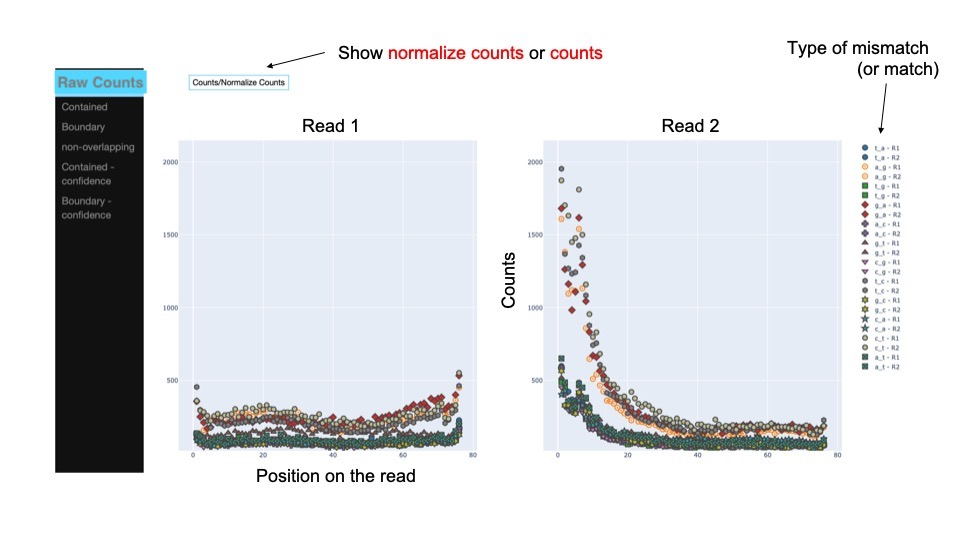

[](http://bioconda.github.io/recipes/fgbio/README.html)
[](https://www.gnu.org/licenses/agpl-3.0)
[](https://www.python.org)


Tasmanian
====
    
A tool for the analysis of reference mismatches in high throughput sequencing data from DNA samples. Unlike other tools, it is able to evalutate the portions of reads that overlap with specified regions (e.g. Repeats)


<!---toc start-->
  * [Goals](#goals)
  * [Install](#install)
  * [Contributing](#contributing)
  * [Authors](#authors)
  * [License](#license)

<!---toc end-->

# Install
conda: `conda install -c bioconda tasmanian-mismatch`  
pip:   `pip install tasmanian-mismatch`


# Goals

The main goal is to identify systematic missmatches that might confound SNPs or other variations that should or should not be associated to biological outcomes. Since we noticed a set of regions, which might not necessarily be missplaced in the reference genome, have dramatic effects in this analysis, we provide a way of spliting these reads and incorporate the information in different tables, so that intersecting/non intersecting reads are not filtered out. Also, the researcher has a more accurate picture of the influence of these regions in the observed artifacts.

### Overview of Tasmanian use:

```bash
samtools view bam | run_intersections [OPTIONS] | run_tasmanian [OPTIONS]
```

1. Classification of each base of the read into overlapping (in which case could be contained or boundary - see figure below) or Non-overlapping with regions of interest included in a bed/bedgraph file.
2. Positional analysis of artifacts splitted by read 1 and read 2.


---

### The output includes tables to manupulate and plot the data and a built in report for fast access the data (see figure below).



* Easy to use command-line and [nextflow](https://www.nextflow.io/) implementation.
* Includes a [Galaxy](https://toolshed.g2.bx.psu.edu/) wrapper 


## Contributing

Contributions are welcome and encouraged.

## Running Tests

To run the test suite for Tasmanian, follow these steps:

1. Create a virtual environment:
  ```
  python3.10 -m venv tasmanian_venv
  source tasmanian_venv/bin/activate
  ```

2. Install dependencies:
  ```
  pip install -r requirements.txt
  ``` 

3. Run the tests:
  ```
  bash tasmanian/tests/basic_tests.sh
  ```

## Authors

* [Brad Langhorst](https://github.com/bwlang)
* [Ariel Erijman](https://github.com/aerijman)

## License

`tasmanian artifact metrics tool` is open source software released under the [GNU License](LICENCE.txt).

