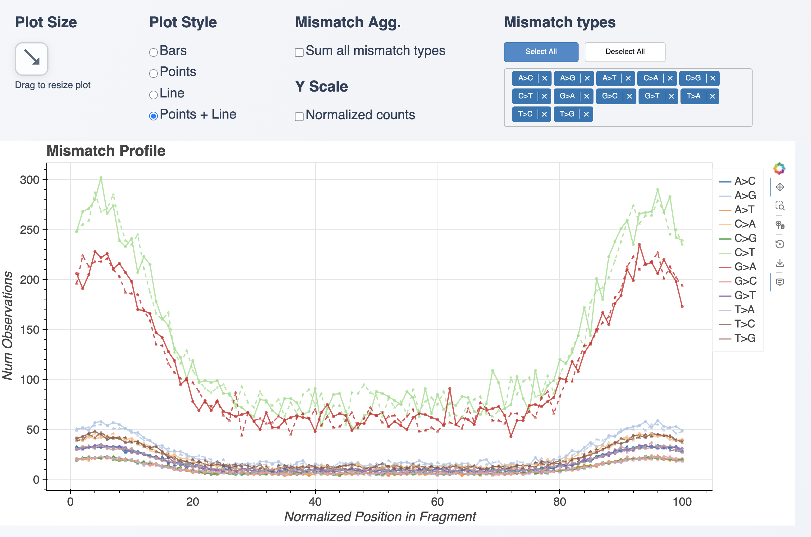

# Tasmanian-mismatch

[](https://github.com/nebiolabs/tasmanian-mismatch/actions/workflows/ci.yml)
[](https://github.com/nebiolabs/tasmanian-mismatch/actions/workflows/ci-metrics.yml)

## Abstract

DNA preservation, extraction, fragmentation, and library preparation can introduce systematic sequencing errors that are distinct from true biological variation. These artifacts often follow characteristic patterns tied to sequence context, strand orientation, or position within a read — for example, FFPE samples are known to produce read-position-dependent mismatch signatures. Tasmanian-Mismatch was built to characterize and quantify such error patterns across sequencing datasets, helping researchers distinguish technical artifacts from genuine genomic variation. The resulting models can also be used to recalibrate base-quality scores, reducing the technical noise passed to downstream variant callers and improving the accuracy of variant discovery.

Tasmanian-Mismatch is a toolkit for mismatch analysis on indexed BAM files against a reference FASTA. The repository currently builds three binaries:

- `tasmanian-mismatch`: count mismatches by read position or fragment position
- `tasmanian-diagnostics`: report genomic mismatch sites, overlap inconsistencies, and read-position discount tables
- `tasmanian-rescale-quality`: rescale BAM quality scores from a tab-delimited matrix

## Example Visualization

Generate an interactive HTML plot from any output TSV:
```bash
pixi run python scripts/visualize.py tests/fixtures/test_data.tsv
```



## Build

```bash
cargo build --release
```

Release binaries:

```text
./target/release/tasmanian-mismatch
./target/release/tasmanian-diagnostics
./target/release/tasmanian-rescale-quality
```

## Inputs

- Coordinate-sorted BAM with index (`.bai`)
- Reference FASTA
- Optional BED file for masking or whole-read filtering
- Optional discount table from `tasmanian-diagnostics`
- Optional rescaling matrix for `tasmanian-rescale-quality`

## Binary Overview

### `tasmanian-mismatch`

Count mismatch classes such as `C>T`, `G>A`, `A>C` by either read position or fragment position.

Basic usage:

```bash
tasmanian-mismatch <BAM> <REFERENCE_FASTA> [OPTIONS]
```

Common options:

```bash
-t, --threads <N>                 Number of threads (0 keeps rayon default)
-r, --region-size <BP>            Region size for indexed chunking
-q, --min-base-quality <QUAL>     Minimum base quality
-m, --min-map-quality <MAPQ>      Minimum mapping quality
--position-mode <read|insert>     Position mode (default: insert)
--overlap-mode <cut|stretch>      Overlap handling mode
--discount-table <TSV>            Discount table from tasmanian-diagnostics
-b, --bed-file <BED>              BED file for masking/filtering
--bed-filter-mode <mask|filter|include>  BED handling mode ('include' keeps only reads
                                          overlapping the BED file -- an in-silico exome/panel
                                          restriction; 'mask'/'filter' exclude BED regions)
-f <FLAGS>                        SAM flags that must be present
-F <FLAGS>                        SAM flags that, if present, skip a read
-G <FLAGS>                        SAM flags that, if all present, skip a read
--min-fragment-length <LEN>       Minimum fragment length for insert mode
--max-fragment-length <LEN>       Maximum fragment length for insert mode
--min-read-position <N>           Minimum position-mode axis position (1-based, inclusive) to include
--max-read-position <N>           Maximum position-mode axis position (1-based, inclusive) to include
--methylation-mode                Collapse methylation-driven mismatch classes
--normalize                       Write normalized frequencies instead of raw counts
--emit-rescaling-matrix           Emit matrix rows for tasmanian-rescale-quality
--plot                            Launch the optional Bokeh visualization
--window-size <BP>                Report per-window mismatch rates instead of the genome-wide table
--bootstrap <N>                   Add 95% block-bootstrap confidence intervals (N replicates)
--bootstrap-seed <SEED>           Seed for --bootstrap (default: 1)
--bootstrap-diagnostics <TSV>     Write a per-class histogram of block residuals for --bootstrap
--bootstrap-rates <TSV>           Write per-position class rates with --bootstrap intervals
-o, --output-file <TSV>           Output path
```

Examples:

```bash
# Raw mismatch counts by fragment position
tasmanian-mismatch sample.bam reference.fa \
  --position-mode insert \
  -o mismatch_counts.tsv

# Read-position counts with a diagnostics-derived discount table
tasmanian-mismatch sample.bam reference.fa \
  --position-mode read \
  --discount-table variant_discounts.tsv \
  -o mismatch_counts.tsv

# Pipe discount table via stdin (use '-' to read --discount-table from stdin)
cat variant_discounts.tsv | tasmanian-mismatch sample.bam reference.fa \
  --position-mode read \
  --discount-table - \
  -o mismatch_counts.tsv

# Normalized frequencies instead of integer counts
tasmanian-mismatch sample.bam reference.fa \
  --position-mode read \
  --normalize \
  -o mismatch_normalized.tsv

# Restrict to read positions 5-40 (e.g. to minimize sequencer read quality effects)
tasmanian-mismatch sample.bam reference.fa \
  --position-mode read \
  --min-read-position 5 \
  --max-read-position 40 \
  -o mismatch_positions_5_40.tsv

# Emit rescaling matrix rows to stdout (or -o file.tsv)  --> _Under development_
tasmanian-mismatch sample.bam reference.fa \
  --position-mode read \
  --emit-rescaling-matrix

# Keep only reads overlapping the given BED regions, e.g. In-silico exome
tasmanian-mismatch sample.bam reference.fa \
  -b exome_targets.bed --bed-filter-mode include \
  -o mismatch_exome_only.tsv

# Mismatch rates in 1 Mb windows along the genome
tasmanian-mismatch sample.bam reference.fa \
  --window-size 1000000 \
  -o mismatch_windows.tsv

# Genome-wide table with 95% confidence intervals from 1000 bootstrap replicates
tasmanian-mismatch sample.bam reference.fa \
  --bootstrap 1000 \
  -o mismatch_with_ci.tsv
```

### `tasmanian-diagnostics`

Produce three diagnostic outputs:

- genomic mismatch sites (`potential_variants.tsv`)
- paired-read overlap inconsistencies (`read_pair_inconsistencies.tsv`)
- mismatch discount table (`variant_discounts.tsv`)

Basic usage:

```bash
tasmanian-diagnostics <BAM> <REFERENCE_FASTA> [OPTIONS]
```

Common options:

```bash
-t, --threads <N>                    Number of threads (0 keeps rayon default)
-r, --region-size <BP>                Region size for parallel processing
-q, --min-base-quality <QUAL>         Minimum base quality
--min-map-quality <MAPQ>              Minimum mapping quality
-m, --methylation                     Convert C/T in read 1 back to C (bisulfite/EM-seq)
--use-insert-mode                     Use fragment-level instead of read-level positions
--min-fragment-length <LEN>           Minimum estimated fragment length for a read to be counted
--max-fragment-length <LEN>           Maximum estimated fragment length for a read to be counted
--genomic-threshold <N>               Minimum mismatch count for reporting a genomic site
--genomic-depth-threshold <N>         Minimum depth for reporting a genomic site
-b, --bed-file <BED>                  BED file for masking/filtering
--bed-filter-mode <mask|filter|include>  BED handling mode (requires -b)
-f <FLAGS>                            SAM flags that must be present
-F <FLAGS>                            SAM flags that, if present, skip a read
-G <FLAGS>                            SAM flags that, if all present, skip a read
--variants-output <TSV>               Genomic variants output (default: potential_variants.tsv)
--inconsistencies-output <TSV>        Overlap inconsistencies output (default: read_pair_inconsistencies.tsv)
--discount-output <TSV>               Discount table output (default: variant_discounts.tsv), use '-' for stdout
```

Example:

```bash
tasmanian-diagnostics sample.bam reference.fa \
  --variants-output potential_variants.tsv \
  --inconsistencies-output read_pair_inconsistencies.tsv \
  --discount-output variant_discounts.tsv
```

Direct piping to `tasmanian-mismatch` is supported by writing discounts to stdout:

```bash
tasmanian-diagnostics sample.bam reference.fa \
  --variants-output potential_variants.tsv \
  --inconsistencies-output read_pair_inconsistencies.tsv \
  --discount-output - | \
tasmanian-mismatch sample.bam reference.fa \
  --position-mode read \
  --discount-table - \
  -o mismatch_counts.tsv
```

The `variant_discounts.tsv` output can be consumed by `tasmanian-mismatch` using `--discount-table`.

### `tasmanian-rescale-quality`

Rewrite BAM base qualities from a rescaling matrix keyed by read number, read position, reference base, and observed read base.

Basic usage:

```bash
tasmanian-rescale-quality <BAM> <REFERENCE_FASTA> <MATRIX_TSV> [OPTIONS]
```

Use `-` as `<MATRIX_TSV>` to read matrix rows from stdin.

Example:

```bash
tasmanian-rescale-quality sample.bam reference.fa quality_matrix.tsv \
  -o rescaled.bam

# Consume matrix from stdin
cat quality_matrix.tsv | tasmanian-rescale-quality sample.bam reference.fa - \
  -o rescaled.bam
```

## Workflow

The intended workflow is:

1. Run `tasmanian-mismatch` to get raw mismatch counts.
2. Optionally run `tasmanian-mismatch --normalize` to get within-group mismatch frequencies.
3. Optionally convert normalized frequencies into a rescaling matrix for `tasmanian-rescale-quality`.
4. Run `tasmanian-diagnostics` when you need genomic-site summaries or a discount table.
5. Feed `variant_discounts.tsv` back into `tasmanian-mismatch` via `--discount-table` if desired.

Important distinction:

- `tasmanian-mismatch` output is not the direct input to `tasmanian-rescale-quality`
- `tasmanian-rescale-quality` expects a matrix with columns `read_num`, `position`, `ref_base`, `read_base`, `scaling_factor`
- `variant_discounts.tsv` is for `tasmanian-mismatch`, not for `tasmanian-rescale-quality`

Direct pipe from mismatch into rescale-quality:

```bash
tasmanian-mismatch sample.bam reference.fa \
  --position-mode read \
  --emit-rescaling-matrix | \
tasmanian-rescale-quality sample.bam reference.fa - \
  -o rescaled.bam
```

## Output Formats

### `tasmanian-mismatch` raw output

Read-position mode:

```tsv
base_change	read_num	reference_order	read_position	count
C>T	1	1	42	18
C>A	1	1	42	3
G>A	2	2	17	11
```

Fragment-position mode uses the same columns except `read_position` becomes `fragment_position`.

### `tasmanian-mismatch --normalize`

```tsv
base_change	read_num	reference_order	read_position	normalized_frequency
C>T	1	1	42	0.782609
C>A	1	1	42	0.130435
C>G	1	1	42	0.043478
```

Normalization is performed within each `(read_num, position, ref_base)` group. For example:

```text
C>T / (C>A + C>C + C>G + C>T)
```

If a group's total count is zero (e.g. after `--discount-table` has reduced every count in the group to zero), its frequency is reported as `0.0` rather than `NaN`.

### `tasmanian-mismatch --bootstrap N`

The usual table gains a normalized `frequency` (as in `--normalize`) and its 95% confidence
interval. With `--normalize`, the `count` and `frequency` columns are replaced by
`normalized_frequency`.

```tsv
base_change	read_num	reference_order	read_position	count	frequency	ci_low	ci_high
C>T	1	1	1	14	0.001409	0.000673	0.002399
```

The intervals come from a block bootstrap. The genome is cut into `--region-size` blocks
(default 1 Mb). Each replicate redraws that many blocks, with replacement, from the blocks
that contained counted reads, then recomputes every frequency. `ci_low` and `ci_high` are the
2.5% and 97.5% quantiles across replicates. Resampling whole blocks rather than single reads
keeps nearby observations together (real variants, duplicates and local sequence context all
cluster), so the intervals aren't overconfident. A warning is logged when fewer than 20 blocks
contain data, as with a small panel. Lowering `--region-size` gives more, smaller blocks.
Discounts from `--discount-table` are subtracted from every replicate. The same
`--bootstrap-seed` always gives the same intervals, whatever the thread count.

`--bootstrap-diagnostics PATH` checks whether the blocks differ by more than counting noise.
For each mismatch class (per read, pooled over positions), each block gets a Pearson residual
against the pooled rate `p`:

```text
z = (count - ref_total * p) / sqrt(ref_total * p * (1 - p))
```

If blocks differ only by chance, `z` is roughly N(0, 1). The TSV holds each class's residual
histogram (`bin_low`, `bin_high`, `blocks`) beside the count N(0, 1) predicts
(`expected_blocks`), plus the dispersion `sum(z^2) / (blocks_used - 1)`. Dispersion near 1
means the blocks are homogeneous. Well above 1 means some blocks really differ. The log names
each class's most extreme block, which `--window-size` can narrow down. Blocks expecting fewer
than 5 mismatches of a class are left out of that class, since small-count residuals are too
skewed to compare with N(0, 1). The residuals use counts from before `--discount-table` is
applied.

### `tasmanian-mismatch --bootstrap N --bootstrap-rates PATH`

Per-position mismatch rates with 95% intervals from the same bootstrap replicates, pooled
over reference orders:

```tsv
read_num	fragment_position	class	count	ref_total	rate	ci_low	ci_high	all_bases	rate_all	rate_all_ci_low	rate_all_ci_high
1	1	C>T/G>A	8648	7498201	1.153343e-3	1.071350e-3	1.267275e-3	19318046	4.476642e-4	...	...
```

`class` is one of the 12 A/C/G/T mismatch classes (`count / ref_total` of its reference
base), one of the 6 strand-folded classes (`C>T/G>A` = `(C>T + G>A) / (C + G)`), or `N>N`
(all mismatches over all bases). `rate_all` divides each class's count by every base observed
at the position instead, so the classes' `rate_all` values add up to the `N>N` rate: the 12 raw
classes do, and so do the 6 folded ones. Unlike the main table's per-row intervals, these can be
compared across positions and libraries directly, since each row is a complete rate. Rows
whose denominator is zero are omitted.

### `tasmanian-mismatch --window-size BP`

One row per window, read and mismatch class, pooled over all read/fragment positions:

```tsv
chrom	start	end	read_num	base_change	count	ref_total	rate	all_bases	rate_all
chr7	0	1000000	1	C>T	2	3645	0.000549	14580	0.000137
chr7	0	1000000	1	C>A	0	3645	0.000000	14580	0.000000
```

Windows are 0-based and half-open, tile each contig from position 0, and are written in BAM
header order. A read belongs to the window containing its alignment start. `ref_total` counts
every base read against the class's reference base (`C>A + C>C + C>G + C>T` for `C>T`), and
`rate = count / ref_total`. `all_bases` counts every A/C/G/T base on that read in the window,
and `rate_all = count / all_bases`, so a read's classes' `rate_all` values add up to its overall
mismatch rate in the window. Every A/C/G/T mismatch class whose reference base was observed
gets a row, with a zero count if it never occurred. Windows with no counted reads are
omitted. Windows are counted inside the usual `--region-size` processing chunks, which are
rounded up to whole windows, so small windows don't cost one BAM fetch each. `--window-size`
can't be combined with `--normalize`, `--emit-rescaling-matrix`, `--discount-table`, `--plot`
or `--bootstrap`.

### `potential_variants.tsv`

```tsv
chromosome	position	reference_base	mismatch_base	count	depth
chr1	10452	C	T	12	38
chr1	20891	G	A	9	27
chr2	450103	A	C	15	41
```

### `read_pair_inconsistencies.tsv`

```tsv
read1_position	read2_position	discordance_type	count
18	83	R1:A_R2:G	5
19	82	R1:C_R2:T	3
20	81	R1:G_R2:A	7
```

### `variant_discounts.tsv`

```tsv
mismatch_type	read_num	read_position	discount_count
C>T	1	42	6
G>A	2	17	4
A>C	1	88	9
```

This table is read-position keyed and can be supplied to `tasmanian-mismatch` through `--discount-table`.

### Rescaling matrix for `tasmanian-rescale-quality`

```tsv
1	42	C	T	0.85
1	42	C	A	1.10
2	17	G	A	0.65
```

Columns:

```text
read_num    position    ref_base    read_base    scaling_factor
```

## BED Filtering

BED-aware handling is available in both `tasmanian-mismatch` and `tasmanian-diagnostics`.

```bash
# Mask bases overlapping BED intervals
tasmanian-mismatch sample.bam reference.fa \
  -b regions.bed \
  --bed-filter-mode mask

# Drop whole reads overlapping BED intervals
tasmanian-mismatch sample.bam reference.fa \
  -b regions.bed \
  --bed-filter-mode filter
```

Modes:

- `mask`: skip only aligned positions overlapping BED intervals
- `filter`: skip the whole read if any aligned portion overlaps a BED interval

See [BED_FILTERING.md](BED_FILTERING.md) for details.

## Integration Tests

Current integration coverage:

- [tests/mismatch_integration.rs](tests/mismatch_integration.rs): fixture-driven test for `tasmanian-mismatch`
- [tests/diagnostics_integration.rs](tests/diagnostics_integration.rs): fixture-driven test for `tasmanian-diagnostics`
- [tests/rescale_integration.rs](tests/rescale_integration.rs): end-to-end test for `tasmanian-rescale-quality`
- [tests/all_binaries_and_pipes_integration.rs](tests/all_binaries_and_pipes_integration.rs): end-to-end test piping all three binaries together

Each integration test synthesizes its own minimal BAM fixture at runtime (into a temp directory); no BAM files are checked into the repo. Reusable helpers live in [tests/test_utils.rs](tests/test_utils.rs).

Run the full test suite with:

```bash
cargo test --all-targets
```

## Notes

- The `-m` short flag differs by binary: it's `--min-map-quality` on `tasmanian-mismatch` but `--methylation` on `tasmanian-diagnostics`. Double-check which binary you're invoking when using short flags.
- `tasmanian-mismatch` and `tasmanian-diagnostics` currently use slightly different emitted position conventions in some outputs; tests document the current behavior.
- `frequencies_to_rescaling_matrix` exists as a placeholder conversion step in the library and currently emits `1.0` scaling factors.
- `reference_order` in mismatch output indicates which read in a pair appears first in reference coordinates.

## License
AGPL v3
