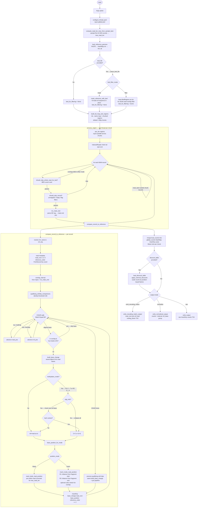

# Tasmanian Mismatch — Control Flow

## Key design decisions

| Decision point | Options |
|---|---|
| BED handling | `mask` mutates the reference in place; `filter` skips whole reads at query time |
| Overlap mode | `Cut` drops R2 bases in the overlap; `Stretch` applies a cubic spline to map both reads' positions into `[1, 2×max_read_len]` without dropping bases |
| Position mode | `Read` — position within the read; `Insert` — position relative to fragment start/end |
| Methylation | Global C→T / G→A collapse, or CpG-context-only |
| Parallelism | `rayon` parallel over 1 Mbp chunks; each chunk uses an independent `IndexedReader`; results merged under a `Mutex` |
| Output | Raw counts, normalized frequencies, or rescaling matrix rows for `tasmanian-rescale-quality` |
